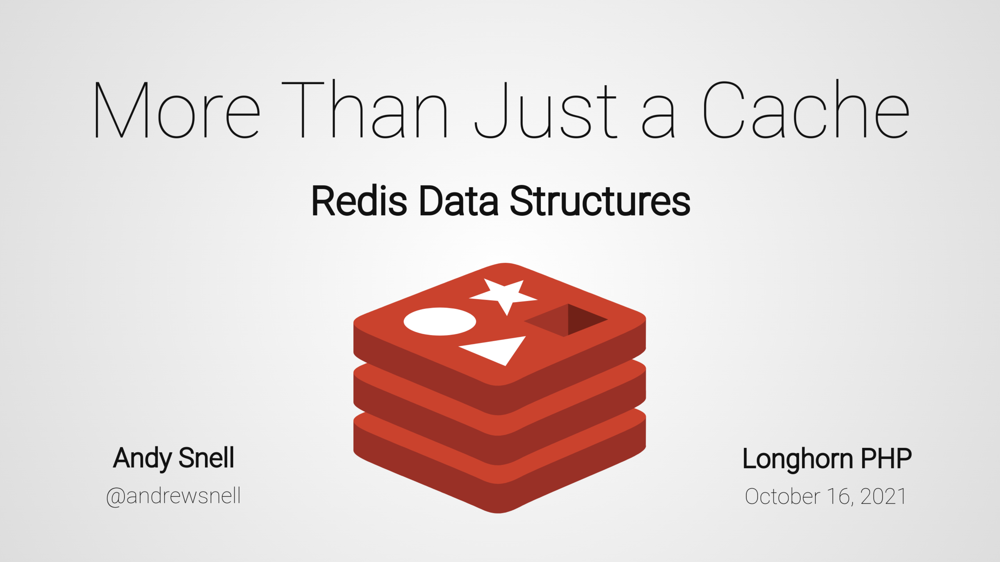
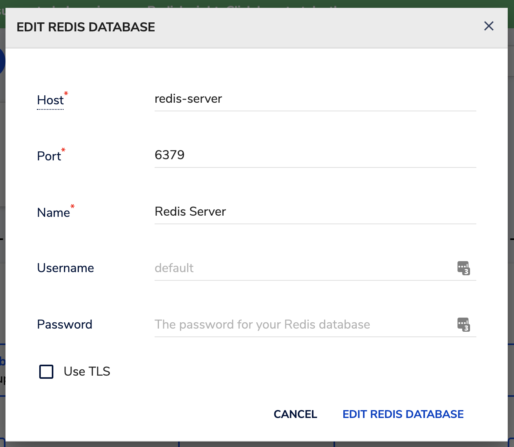

# More Than Just a Cache: Redis Data Structures

Redis is a popular key-value store, commonly used as a cache or message broker
service. However, it can do so much more than just hold string values in memory!
-- Redis is a full-featured “data structure server”. As PHP developers, we
typically don’t think about data structures other than our jack-of-all-trades
array, but Redis can store hashes, lists, sets, and sorted sets, in addition to
operating on string values. In this talk, we’ll explore these basic data
structures in Redis and look at how we can apply them to solve problems like
rate limiting, creating distributed locks, or efficiently checking membership in
a massive set of data.

## Latest Slides

**Slide Deck
Link:** [https://wkdb.yt/redis-slides](https://wkdb.yt/redis-slides)

## Running Code Examples with PHPUnit

Classes for use case examples located in the "src/Examples" directory with
corresponding unit tests in "tests/Examples". Additional tests covering basic
data structure functionality are located in "tests/Structures". All the tests
can be run with PHPUnit, through the included Docker Compose application.

1. Start the Docker Compose[^1] application with `docker-compose up -d`
2. Run `docker-compose run --rm app composer install` to install vendor
   dependencies
3. Run the testsuite with `docker-compose run --rm app vendor/bin/phpunit`
4. All tests should pass.

## Accessing RedisInsight

The Docker Compose application also includes the RedisInsight desktop manager
for Redis. When the application is running, the GUI is served on port 8001 of
your localhost machine.

1. Start the Docker Compose[^1] application with `docker-compose up -d`
2. Navigate to localhost:8001 in your web browser
3. Review and agree to the license terms.
4. Add a new Redis Database with hostname `redis-server`, port `6379`, and your choice
   of name.

### Stopping the Docker Compose Application

`docker-compose down`

## Resources

* [Redis](https://redis.io/)
* [Official Docker Image for Redis Server](https://hub.docker.com/_/redis)
* [RedisInsight Documentation](https://developer.redis.com/explore/redisinsight/)
* [Redis Documentation: An introduction to Redis data types and abstractions](https://redis.io/topics/data-types-intro)
* [Redlock Distributed Lock Algorithm](https://redis.io/topics/distlock)
* [Redis Server Source Code](https://github.com/redis/redis)
* [PhpRedis Extension](https://github.com/phpredis/phpredis)

[^1]: If you do not already have it installed, you will need to install the
appropriate version of [Docker](https://docs.docker.com/get-docker/)
and [Docker Compose](https://docs.docker.com/compose/install/) for your working
environment. 